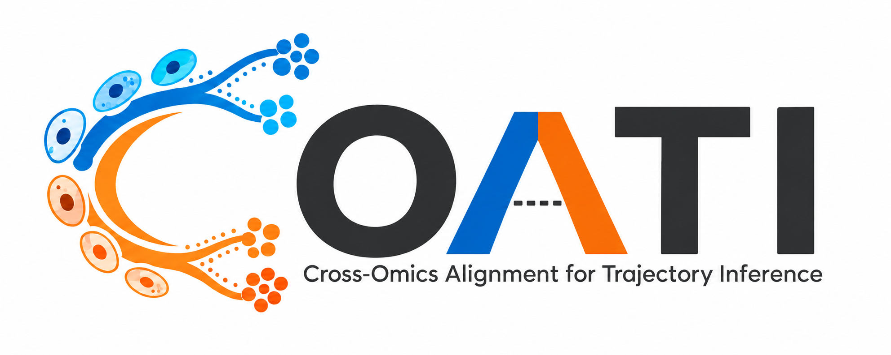

<p align="center"></p>

# COATI

Cross-Omics Alignment for Trajectory Inference. A portable Python interface around the TraInf neural dynamic optimal transport engine, with optional synchronized secondary-modality constraints.

## Install

```bash
python -m venv .venv
source .venv/bin/activate
python -m pip install -e '.[notebooks,docs,dev,anndata]'
```

Run these commands from this repository. The distribution name is `coati-trajectory`; import it as `coati`. This package is not yet published on PyPI.

## Python

```python
import coati as ct

data = ct.datasets.paired()
config = ct.Config(niters=200, sync_loss=True, sync_weight=0.35)
result = ct.fit(data, config)  # creates a unique outputs/run-* directory
trajectory = result.predict()
result.plot()
print(result.evaluate())
```

## Scripts and notebooks

```bash
python examples/run_toy.py --dataset gaussian --output outputs/gaussian
python examples/run_toy.py --dataset split --output outputs/split
python examples/run_toy.py --dataset paired --output outputs/paired
coati toy --dataset split --unbalanced --output outputs/unbalanced
python -m jupyterlab notebooks/
```

Each run directory must be new. Results include the resolved config, input snapshots, checkpoint, TensorBoard logs and metadata. CLI runs also write metrics and a trajectory figure.

- [01 · Gaussian translation](notebooks/01_gaussian.ipynb)
- [02 · Paired modalities](notebooks/02_paired.ipynb)
- [03 · Splitting and growth](notebooks/03_split.ipynb)
- [04 · Input formats](notebooks/04_inputs.ipynb)

## Your own data

```python
data = ct.TemporalData.from_npz(
    "primary.npz", secondary_path="secondary.npz",
    keys=["early", "middle", "late"], times=[0.0, 0.5, 1.0],
)
# Also: TemporalData(list_of_arrays, times), from_dict, from_csv,
# from_dataframe, from_anndata and from_h5ad.
```

Cross-modal inputs must be paired **within each snapshot**, including row identity and ordering. Across-time cells may be unpaired and counts may differ. Inputs are used as supplied: no hidden normalization, PCA or log transform.

## Documentation

```bash
python -m sphinx -W --keep-going -b html docs docs/_build/html
python -m http.server 8000 --directory docs/_build/html
```

The documentation uses Sphinx + Furo and includes a Read the Docs configuration. See [migration](docs/migration.md) for the exact scope of the packaging changes and [validation](docs/validation.md) for verification results.

## Structure

```text
src/coati/           public data, config, training and result interfaces
src/coati/_core/     preserved research engine with package-relative imports
examples/           script entry point
notebooks/          executable cell-by-cell tutorials
tests/              data and training checks
scripts/            original-engine equivalence verification
docs/               Sphinx documentation source
provenance/         source hashes and validation records
assets/             supplied COATI logo
```

The original TraInf repositories are not dependencies and are not modified. Defaults are explicit toy-oriented choices; this release does not claim biological validation. Reference interface inspiration: [CytoBridge](https://github.com/zhenyiizhang/CytoBridge) and its [documentation](https://cytobridge.readthedocs.io/en/latest/index.html). No CytoBridge implementation is copied.
