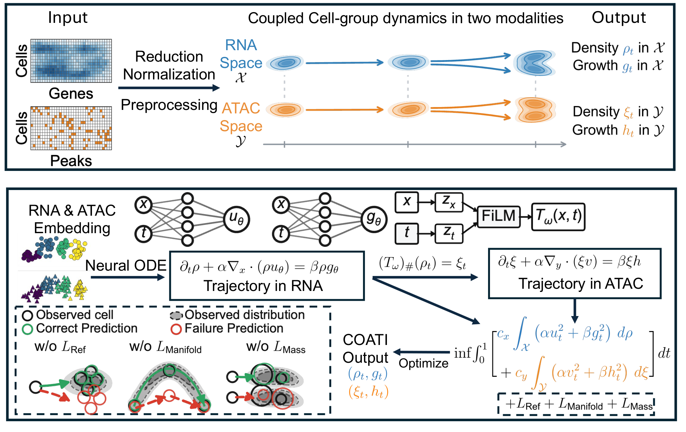

# COATI

```{raw} html
<video controls playsinline preload="metadata" poster="_static/coati-intro-poster.png" style="width:100%;height:auto;border-radius:8px;background:#FAFBFD" aria-label="COATI animated introduction: from paired snapshots to coupled trajectories" aria-describedby="animation-caption">
  <source src="_static/coati-intro.mp4" type="video/mp4">
  <p><a href="_static/coati-intro.mp4">Download the COATI introduction video</a>.</p>
</video>
<p id="animation-caption">Two initial cell populations and five staggered terminal groups, with different covariance shapes. A 2D projection is mapped onto a 3D Gaussian-bump surface. Compare sync weights, inspect a fitted neural velocity field, and follow slow ODE integration. The final cell-distribution panels illustrate missing reference, manifold and mass constraints. Silent, with on-screen equations. The fitted field is a standalone geometric illustration, not a COATI training result.</p>
```

[Download video](_static/coati-intro.mp4) · [Animation source and formula notes](https://github.com/shankswang953/COATI/tree/main/animations)

COATI reconstructs continuous trajectories from paired snapshots. A Neural ODE evolves cells in the primary space, and a fixed cross-modal map carries that same trajectory into the second space. Both spaces constrain the learned flow; a weight controls the balance of energy and manifold penalties while marginal matching remains separately weighted.

```{raw} html
<details>
<summary>Paper overview (static)</summary>
<a href="_static/coati-overview.pdf"></a>
<p><a href="_static/coati-overview.pdf">View overview PDF</a></p>
</details>
```

```python
import coati as ct

data = ct.datasets.paired()
result = ct.fit(data, ct.Config(sync_loss=True, sync_weight=0.35))
result.plot()
```

Start with a small CPU example, inspect the trajectory, and then substitute your own prepared embeddings. The current validation covers synthetic problems; biological runs are intentionally outside this release's verification.

```{toctree}
:maxdepth: 2
:caption: Get started

installation
quickstart
inputs
tutorials
```

```{toctree}
:maxdepth: 2
:caption: Understand and extend

configuration
api
migration
validation
```
