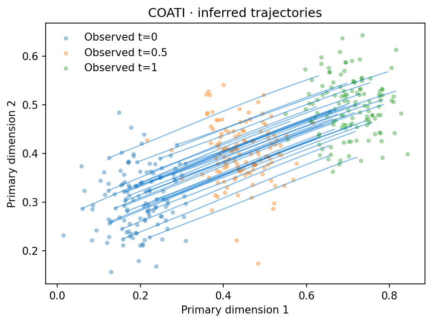

# Validation

Verified on 2026-09-10 using Python 3.10 on macOS ARM64, CPU, in a fresh isolated environment. No biological training was run.

## Original-engine equivalence

Same data, float32 precision, settings and seed in the original and packaged engines. The original device selector is overridden to CPU **only in the comparison harness**; its source files remain untouched.

| Mode | Iterations | Maximum parameter difference |
| --- | ---: | ---: |
| Balanced | 4 | 0 |
| Kernel synchronization | 4 | 0 |
| Unbalanced | 4 | 0 |
| Adaptive lambda | 4 | 0 |
| Synchronized, including gradient diagnostic | 100 | 0 |

The 100-step reference uses an enabled secondary density term, where the original diagnostic is defined. A separate regression check covers a disabled density term, which crashes the original diagnostic and is handled in the COATI copy. These checks establish equality for the tested cases, not every possible backend or experimental option.

## 200-step CPU toy runs

All use seed 0 and 128 initial cells. Endpoint Sinkhorn uses the original per-time median blur, evaluated on all endpoint samples. The floor was estimated with smaller training batches; it is context rather than an exact full-sample threshold.

| Example | Before transport | After transport | Kinetic energy |
| --- | ---: | ---: | ---: |
| gaussian | 0.147707 | 0.000455 | 0.139834 |
| split | 0.146521 | 0.003423 | 0.153955 |
| paired | 0.147707 | 0.000166 | 0.148672 |
| unbalanced | 0.146521 | 0.003776 | 0.001169 |

These arrays were not W2-normalized: kinetic energy need not be near one. Unbalanced energy is stored per particle with mass weights; the reported mean is not the total action. Its predicted total mass ratio is **0.9676**, versus an observed ratio of **2.0**. The short run verifies execution and geometric transport but has **not converged in mass**. Endpoint Sinkhorn is unweighted and should not be interpreted as a mass-aware unbalanced score.

## Interfaces and tutorials

- 12 regression checks passed: adapters, invalid input rejection, save/reload, normalization, secondary projection, accurate kernel and the 100-step disabled-loss diagnostic.
- All four notebooks executed cell by cell, including 200-step training and exact prediction reload checks.
- The Sphinx site builds with warnings treated as errors.
- Core source hashes and both original repositories' starting status are rechecked for preservation.

Machine-readable records are in `provenance/`: `equivalence.json`, `toy_metrics.json`, `notebook_execution.json`, and the tested package list. `scripts/verify_equivalence.py` reruns the read-only original comparison when a TraInf checkout is available.

## Scope

CPU results only. GPU/MPS, large biological datasets, full flow-matching pipelines and downstream biological analyses have not been validated here. This is a usability refactor and synthetic sanity check, not evidence of biological superiority.
